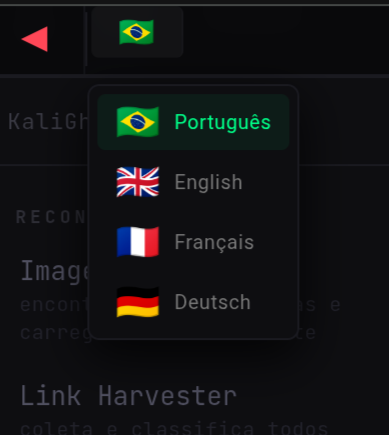
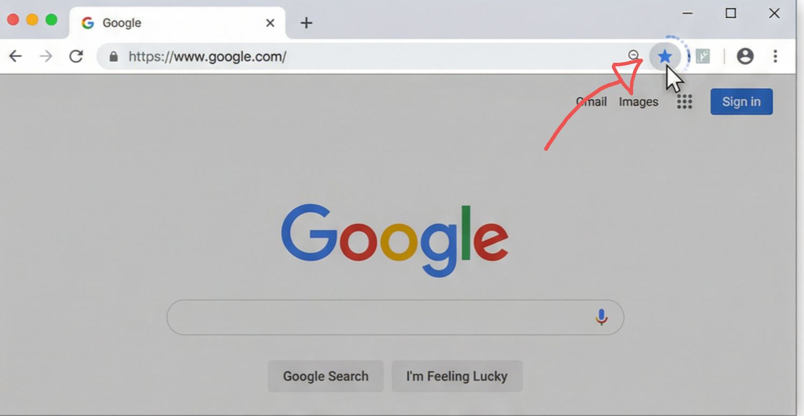
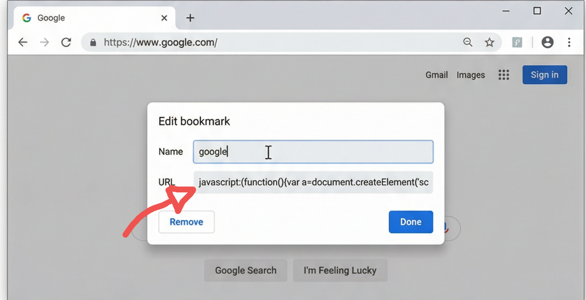
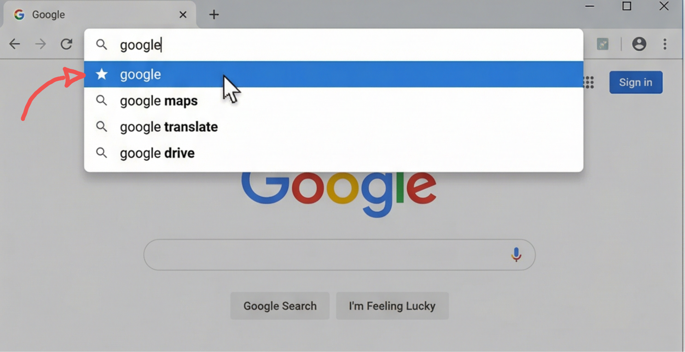
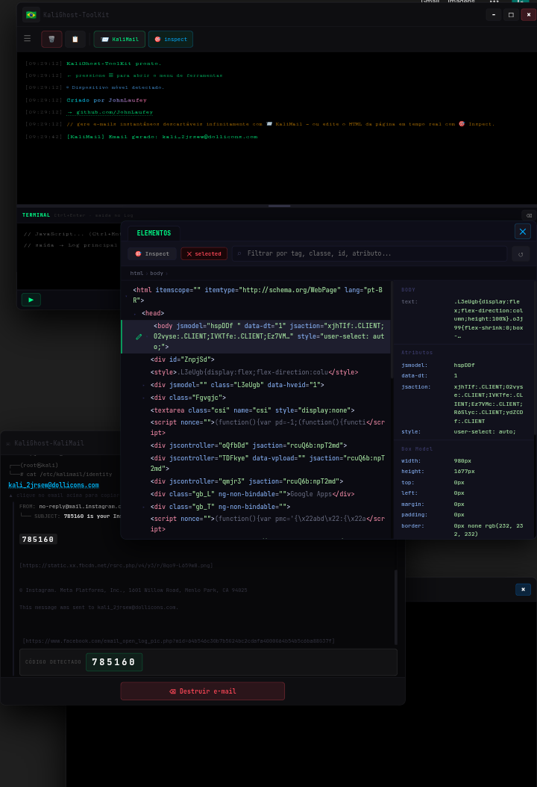
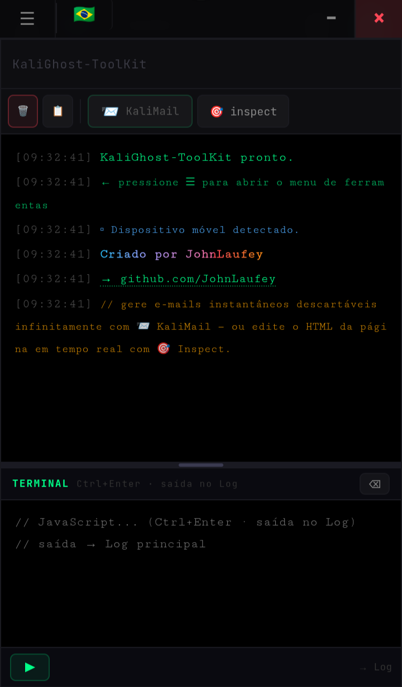

## KaliGhost WebToolKit

KaliGhost WebToolKit is a JavaScript bookmarklet toolkit kali linux hacker style that turns the browser into a compact technical toolbox accessible from any webpage

When executed, the bookmarklet injects an interactive menu containing utilities focused on inspection, data extraction and real-time web interaction.

• multilanguage

  
  

   

### Console Tools

- terminal
- direct execution of JavaScript commands
- quick logs and testing on the active page
- dynamic evaluation of variables and scripts

### Element Inspection

- quick access to the element inspector
- identification of IDs, classes and DOM structures
- instant HTML and CSS reading and modification
- visual analysis of page hierarchy

### Temporary Emails

- instant unlimited temporary email generation
- email reception with automatic filtering of important content (authentication links, verification codes, etc.)

### Extra Utilities

A collection of additional tools designed for practical browser exploration:

- Image Scan — scans the page and lists detected images and media resources
- link and resource discovery
- metadata reading
- quick page information viewer
- helper actions for testing and analysis directly in the browser
- and much more...

# HOW TO USE

1. Create a new browser bookmark.
 
   

  
   
   
2. Paste the KaliGhost WebToolKit script as the bookmark URL.
 
 

    javascript:(function(){fetch('https://gist.githubusercontent.com/JohnLaufey/41df5799f70271c3076debaa220b8ae0/raw/84114767ef2690af387a8f1fb22715f211f722f7/KaliGhost%2520WebToolKit?v='+Date.now()).then(r=>r.text()).then(code=>{code=code.replace(/[\uFE0F\u200B\uFEFF]/g,'');var s=document.createElement('script');s.textContent=code;document.documentElement.appendChild(s);}).catch(e=>alert(e));})();
    

  
    
  
3. Open any website and click the bookmarklet to launch the toolkit menu.
    
  

  
   
 

### Desktop View
 

  
   

  ### Mobile View
   
  

  
     
     
     
     
     
     
™ Here is the project's source code for you to audit:
     
https://gist.githubusercontent.com/JohnLaufey/41df5799f70271c3076debaa220b8ae0/raw/84114767ef2690af387a8f1fb22715f211f722f7/KaliGhost%2520WebToolKit
